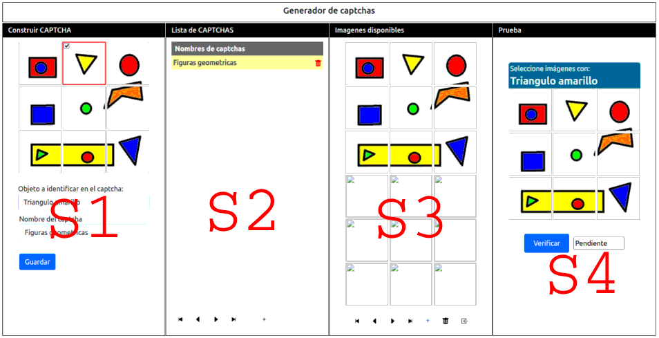

# Generador de CAPTCHAs de Imágenes

 

*(Ejemplo de imagen CAPTCHA)*

##  Descripción
Aplicación web en **Flask** para generar CAPTCHAs basados en selección de imágenes. Ideal para:
- Sistemas de autenticación
- Protección contra bots
- Pruebas de seguridad interactivas

 

##  Características principales
| Sección | Función |
|---------|---------|
| S1 Constructor | Arma CAPTCHAs con imágenes segmentadas |
| S2 Listado | Gestiona CAPTCHAs existentes (editar/eliminar) |
| S3 Banco de imágenes | Visualiza imágenes disponibles (9 segmentos por imagen) |
| S4 Validador | Prueba interactiva de CAPTCHAs generados |

##  Instalación

    1. Clonar repositorio
    git clone [URL_DEL_REPO]

    2. Instalar dependencias
    pip install -r requirements.txt

    3. Ejecutar
    python3 captcha.py

##  Estructura de archivos
    .
    ├── captcha.py         # Aplicación principal
    ├── static/
    │   ├── captchas/      # Imágenes segmentadas
    │   ├── img/           # Assets visuales
    │   └── log/           # Registros del sistema
    ├── templates/         # Vistas HTML
    └── listado.json       # Base de datos de CAPTCHAs

##  Entornos Virtuales (Recomendado)
    # 1. Crear entorno virtual (Python 3)
    python -m venv venv

    # 2. Activar entorno (Linux/Mac)
    source venv/bin/activate

    # 2. Activar entorno (Windows)
    .\venv\Scripts\activate

##  Endpoints clave
    HTTP GET  /                 → Interfaz de generacion de captchas

    HTTP GET  /captcha          → Devuelve un CAPTCHA aleatorio
    HTTP POST /validar          → Valida la solucion dada al CAPTCHA

##  Proceso de importacion de imagenes
    Al importar una imagen se reduce a 300x300px.
    Se divide en 9 segmentos (3x3)
    Cada segmento se almacena como PNG 
    Se codifican en Base64
    Se pueden combinar aleatoriamente para crear CAPTCHAs

