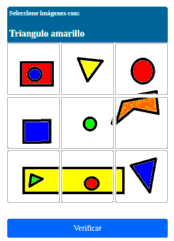

# Generador de CAPTCHAs de Imágenes

 

*(Ejemplo de imagen CAPTCHA)*

##  Descripción
Aplicación web en **Flask** para generar CAPTCHAs basados en selección de imágenes. Ideal para:
- Sistemas de autenticación
- Protección contra bots
- Pruebas de seguridad interactivas

##  Características principales

 

| Sección | Función |
|---------|---------|
| S1 Constructor | Arma CAPTCHAs con imágenes segmentadas |
| S2 Listado | Gestiona CAPTCHAs existentes (editar/eliminar) |
| S3 Banco de imágenes | Visualiza imágenes disponibles (9 segmentos por imagen) |
| S4 Validador | Prueba interactiva de CAPTCHAs generados |

##  Usando la aplicación

 

    1. Botón para validar el captcha
    2. Copia las imágenes seleccionadas en la sección 3 hacia la sección 1
    3. Borra las imágenes seleccionadas en la sección 3
    4. Importar imágenes hacia la aplicación
    5. Crear un captcha nuevo
    6. Texto que nombra el objeto a identificar en el captcha
    7. Nombre que aparece en el listado de la sección 2
    8. Guarda el captcha
    9. Borra un captcha de la aplicación

##  Pasos para crear un nuevo captcha

    1.  (5) Crear un captcha nuevo
    2.  Selecciona las imágenes en la sección 3 (2) Copia las imágenes seleccionadas hacia la sección 1
    3.  (6) Cambiar el texto que nombra el objeto a identificar en el captcha
    4.  Marcar las imágenes en la sección 1
    5.  (8) Guarda el captcha
    6.  Click encima de el nuevo captcha para que la sección 4 se actualice
    7.  (1) Seleccionar las imágenes correctas en la sección 4 y hacer click 
        en el botón para validar el captcha

##  Instalación

    1. Clonar repositorio
    git clone [URL_DEL_REPO]

    2. Instalar dependencias
    pip install -r requirements.txt

    3. Ejecutar
    python3 captcha.py

##  Estructura de archivos
    .
    ├── captcha.py         # Aplicación principal
    ├── static/
    │   ├── captchas/      # Imágenes segmentadas
    │   ├── img/           # Assets visuales
    │   └── log/           # Registros del sistema
    ├── templates/         # Vistas HTML
    └── listado.json       # Base de datos de CAPTCHAs

##  Entornos Virtuales (Recomendado)
    # 1. Crear entorno virtual (Python 3)
    python -m venv venv

    # 2. Activar entorno (Linux/Mac)
    source venv/bin/activate

    # 2. Activar entorno (Windows)
    .\venv\Scripts\activate

##  Endpoints clave
    HTTP GET  /                 → Interfaz de generación de captchas

    HTTP GET  /captcha          → Devuelve un CAPTCHA aleatorio
    HTTP POST /validar          → Valida la solución dada al CAPTCHA

##  Proceso de importación de imágenes
    Al importar una imágen se reduce a 300x300px.
    Se divide en 9 segmentos (3x3)
    Cada segmento se almacena como PNG 
    Se codifican en Base64
    Se pueden combinar aleatoriamente para crear CAPTCHAs

